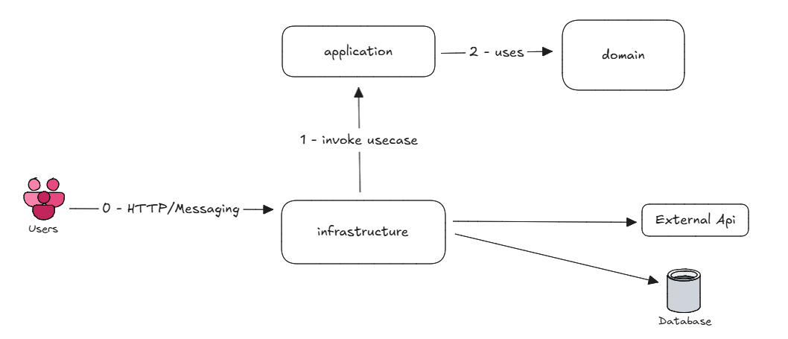
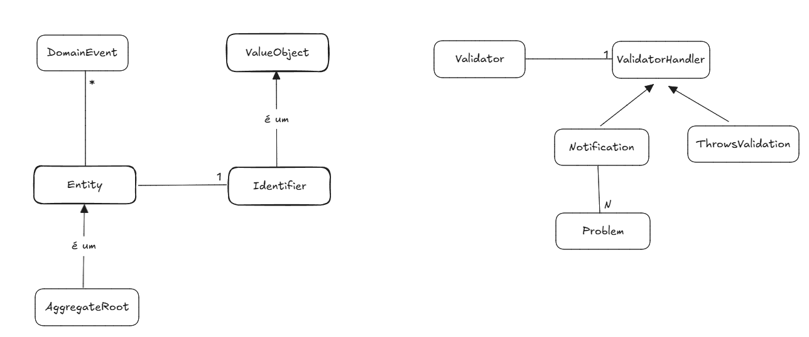
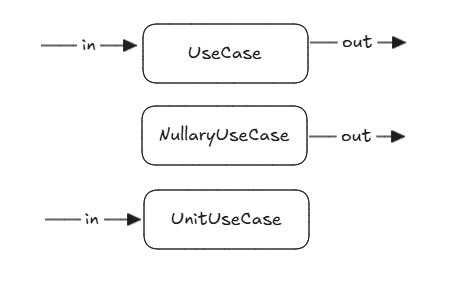
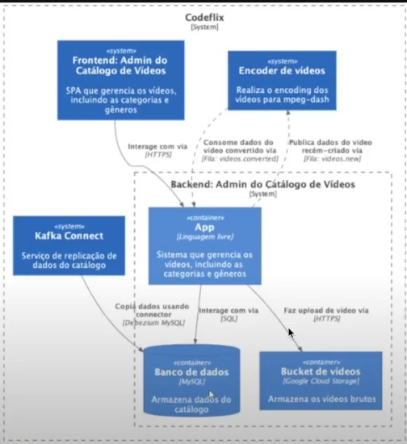

# Microserviço de Administração de Catálogo de Vídeos

Sistema que gerencia os vídeos, incluindo as categorias, gêneros e elenco.

Módulos gradle: domain, application, infrastructure.

- domain         --> contém as regras de negócio mais puras e as entities que modelam isso;
- application    --> contém os casos de uso, chamadas para validação e orquestraçãoda lógica;
- infrastructure --> contém as camadas mais externas, configurações, qualquer comunicação com o mundo exterior;

O código seguiu a prática do TDD com testes de unidade na camada de domínio, 
passando por testes sliced e integrados na camada de application e terminando com e2e onde necessário.

*Clean Archtecture*

---
*Sobre a organização do domínio*:

- Aggregate Root é uma Entidade.
- Entidade tem um Identificador.
- Aggregate Root tem outras Entidades e Value Objects.
- Value Object não tem identidade e pertence a uma Entidade.
- As entidades sabem se validar. Cada agregate tem uma classe de validação `([Entidade]Validator.java)`  com as devidas regras e acumula um ou vários 'Problem's. Dependendo do tipo de Handler, o Problem pode lançar uma exceção ou ser acumulado para tratamento posterior.

Regras de validação [Categoria]:

- Nome - preenchimento obrigatório com ao menos 3 caracteres,
- Descrição - preenchimento opcional,
- Ativar/Inativar - se ativa, deleção é null,
- Auditoria (data de criação, atualização e deleção - se inativa, deleção != null)

Regras de valudação [Gênero]:
- Nome - preenchimento obrigatório
- Relação com [Categoria] N-N. Aqui a recomendação é fazer a lidação apenas com o ID, para evitar concorrência entre os agregates;
- Ativar/Inativar

---
*Camada de Aplicação* 

Os casos de uso tem o papel de orquestar o comportamento das entidades e as chamadas de validação.

Tipos de caso de uso base: classes abstratas que carregam em seu nome a sua intenção e têm um método público `execute`

*Camada de Infraestrutura*

Framework, Gateways, Presenters, DB

